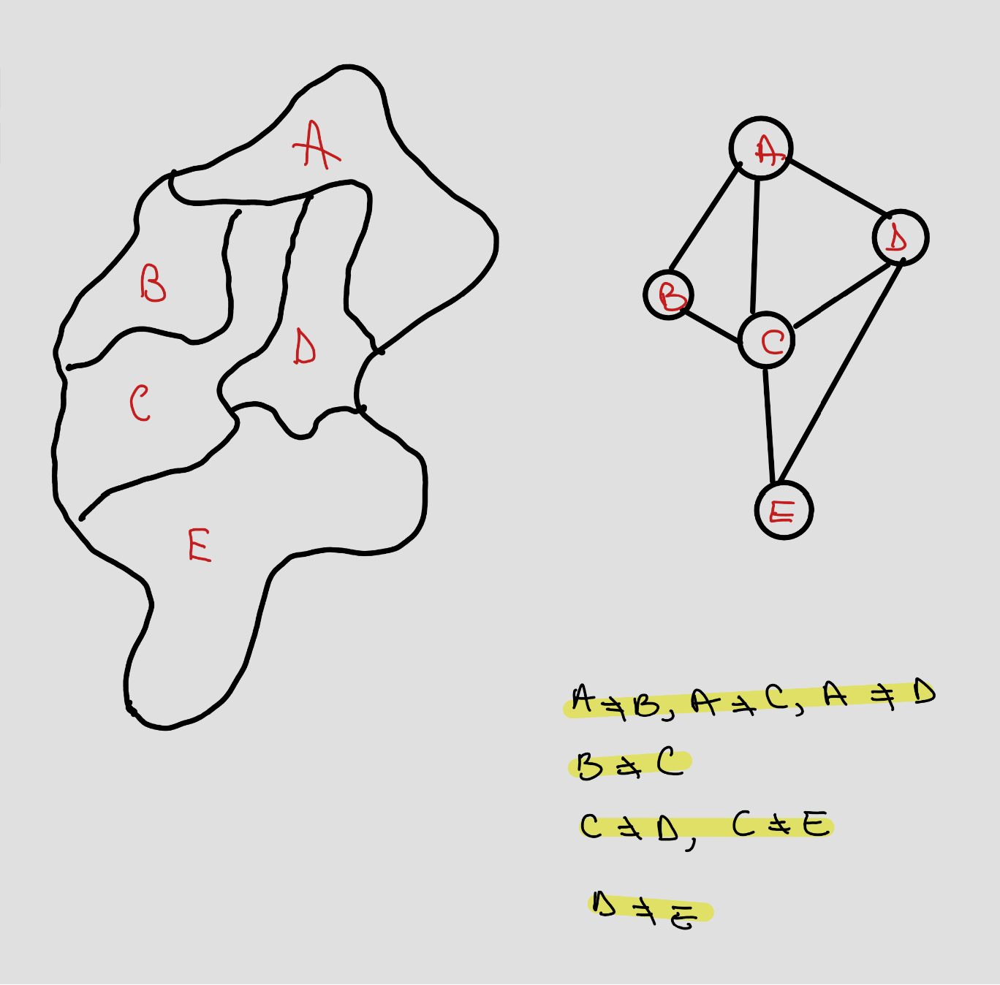

# PROIECT_MAP
### Problema Colorarii Hartilor in C
##### Un grup de N țări trebuie reprezentate pe o hartă cu culori diferite, astfel încât oricare dintre acestea să fie colorată diferit de vecinii săi. Să se scrie un program care primește la intrare lista celor N țări (denumire, listă vecini), lista de culori posibile și determină culoarea pentru fiecare țară în parte.

 Această problemă este o aplicație a ***TEORIEI GRAFURILOR***

