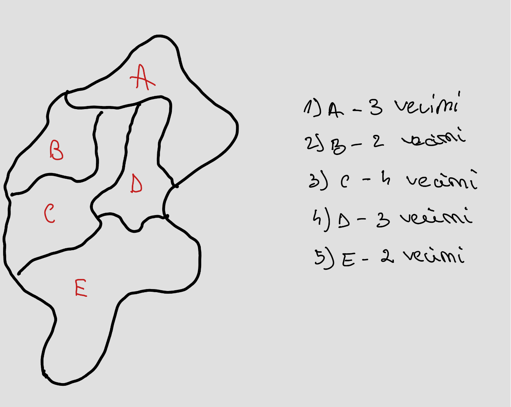
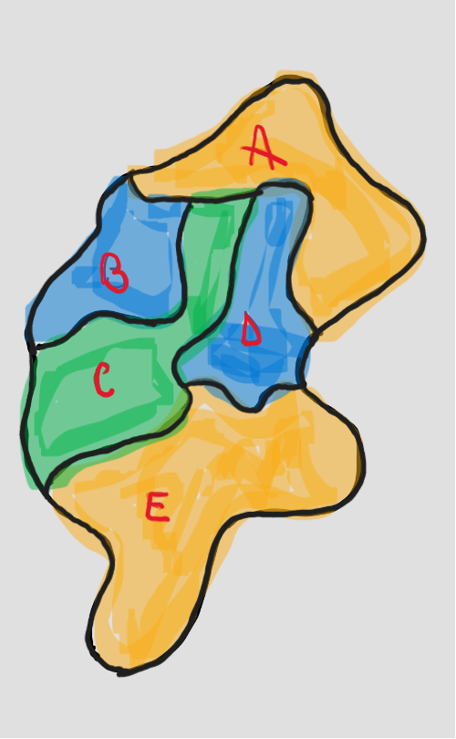

# PROIECT_MAP

## Problema Colorarii Hartilor in C

### Un grup de N țări trebuie reprezentate pe o hartă cu culori diferite, astfel încât oricare dintre acestea să fie colorată diferit de vecinii săi. Să se scrie un program care primește la intrare lista celor N țări (denumire, listă vecini), lista de culori posibile și determină culoarea pentru fiecare țară în parte.

 Această problemă este o aplicație a ***TEORIEI GRAFURILOR***, unde țările sunt reprezentate ca noduri ale unui graf, iar vecinii sunt muchii între aceste noduri.

  

### Date de Intrare
Programul primește următoarele informații:
1. Lista celor N țări, fiecare având o denumire și o listă de vecini
2. Lista de culori posibile pentru colorarea hărții  

### Algoritm
Algoritmul de rezolvare a problemei constă în aplicarea unui algoritm de colorare a grafurilor, cum ar fi "Algoritmul Welsh-Powell" sau "Algoritmul greedy". Acesta va asigura colorarea hărții astfel încât nici două țări vecine să nu aibă aceeași culoare.  

Pentru rezolvarea problemei, primul pas esențial este identificarea vecinilor fiecărei țări. Aceasta implică analizarea structurii de date care reprezintă harta și determinarea relațiilor de vecinătate între țări, ca în imaginea următoare:

  

După ce am identificat corect vecinii fiecărei țări, putem aplica un algoritm de colorare pentru a asigura că nicio țară nu împarte aceeași culoare cu vecinii săi. Un exemplu de astfel de algoritm este "Algoritmul greedy" care începe colorarea cu o țară oarecare și alege apoi pe rând culorile disponibile pentru vecinii săi.
Rezultatul final al programului constă în atribuirea culorilor fiecărei țări, respectând condițiile impuse de relațiile de vecinătate. 

